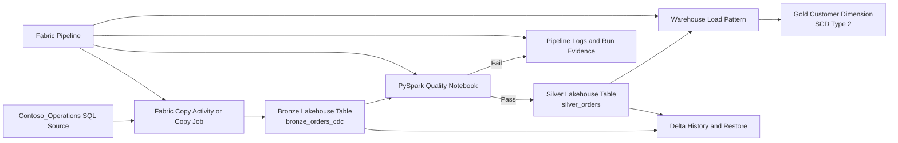

# Getting Started

### Estimated Duration: 20 Minutes

## Scenario

You are joining a Microsoft Fabric data engineering team responsible for modernizing a Contoso operations analytics platform. The Azure-side sandbox access, identity, and source connectivity prerequisites for the lab are already available, but the Microsoft Fabric implementation is intentionally incomplete. Your goal in this challenge lab is to create the required Fabric items and then complete the engineering work needed to land CDC data into Bronze, enforce quality before Silver promotion, preserve customer history in Gold, recover from a simulated Delta table incident, and orchestrate the workflow with observable run-state evidence.

## Lab Overview

This is an advanced, challenge-based lab built around an enterprise medallion architecture in Microsoft Fabric. Rather than following click-by-click instructions, you will validate the sandbox prerequisites and then complete six outcome-focused challenges. Across the lab, you will work with Fabric workspaces, lakehouses, warehouses, notebooks, and pipelines together with Delta Lake capabilities such as history, time travel, and restore.

Azure-side sandbox prerequisites exist when you start the lab, including your learner account and the source-side access needed for the Contoso scenario. However, Fabric and Power BI control-plane items such as workspaces, lakehouses, warehouses, notebooks, pipelines, and semantic models should be treated as learner-created artifacts unless a later exercise explicitly has you validate an item you created earlier. Do not assume those items are pre-seeded for you.

## Objectives

By the end of this lab, you will be able to:

- Confirm the target medallion design for the Contoso workload.
- Create the required Fabric workspace context and core data engineering items for the solution.
- Implement CDC-driven ingestion into a Bronze Delta table.
- Build SCD Type 2 history tracking for a customer dimension in a Fabric Warehouse.
- Enforce Spark-based quality gates before Silver promotion.
- Investigate and recover a corrupted Delta table by using history and restore capabilities.
- Orchestrate the end-to-end workflow and validate both success and failure outcomes.

## Sign in and access the lab environment

1. Open <https://portal.azure.com> and sign in with the following credentials:
   - Username: <inject key="AzureAdUserEmail"></inject>
   - Password: <inject key="AzureAdUserPassword"></inject>
2. Confirm that the active subscription is **<inject key="SubscriptionID"></inject>** and that the Microsoft Entra tenant is **<inject key="TenantID"></inject>**.
3. Record the deployment reference for this sandbox as **<inject key="DeploymentID" enableCopy="false"></inject>**. You may need it when reviewing environment-specific resources or when working with support staff.
4. Open the Microsoft Fabric portal at <https://app.fabric.microsoft.com> by using the same lab credentials.
5. Verify that your account can use Microsoft Fabric capacity in the sandbox and that you can create the Fabric items required by the exercises.

> [!Important]
> Microsoft Fabric workspaces are collaboration containers for control-plane items such as lakehouses, warehouses, notebooks, pipelines, semantic models, and reports. Those items are not Azure ARM resources and should not be assumed to exist unless you create them during the lab or a task explicitly confirms they were created earlier in your own workflow.

## Lab prerequisites

Before you begin Challenge 1, make sure the following conditions are true:

- You can access both the Azure portal and the Microsoft Fabric portal.
- The Contoso operations source connectivity required for ingestion is available in the sandbox.
- Your Fabric account has enough permissions to create or modify a workspace and the Fabric items used in the lab.
- PySpark execution is available for notebook-based validation and transformation work.
- You are comfortable validating outcomes through SQL results, Delta history, notebook output, and pipeline run evidence.

> [!Note]
> This lab assumes Azure-side environment preparation and source-side prerequisites are already available. The exercises focus on designing, creating, and validating the required Microsoft Fabric control-plane objects and data flows rather than onboarding external systems from scratch.

## Challenge sequence

You will complete the lab through the following six challenges:

- **Challenge 1:** Confirm the medallion foundation and create the required Fabric starting point.
- **Challenge 2:** Implement CDC ingestion into the Bronze layer.
- **Challenge 3:** Implement SCD Type 2 history in the Gold Warehouse.
- **Challenge 4:** Enforce Spark-based data quality gates before Silver promotion.
- **Challenge 5:** Audit, recover, and protect data with Delta Lake time travel.
- **Challenge 6:** Orchestrate the end-to-end medallion pipeline with internal run-state validation.

## Architecture

The solution follows a medallion design in which operational changes land in Bronze, validated and curated records move to Silver, and analytical history is preserved in Gold. In Microsoft Fabric, you will create the workspace-scoped items needed for this pattern, including lakehouse, warehouse, notebook, and pipeline assets, and then connect them into one observable engineering workflow.

## Components explained

### Contoso_Operations SQL source

This is the operational source system for the lab. It includes CDC-enabled business tables such as Orders, Customers, and Products. Your ingestion work focuses on capturing changes from this source into Fabric rather than performing repeated full loads.

### Fabric workspace

The workspace is the control-plane boundary in which you organize and manage the items required for the lab. A workspace can contain lakehouses, warehouses, notebooks, pipelines, and related analytics artifacts. In this challenge lab, you should expect to create or complete the workspace-scoped implementation needed for the scenario.

### Bronze layer

The Bronze layer stores raw ingested changes in a Fabric Lakehouse using Delta tables. In this lab, `bronze_orders_cdc` is the primary target used to prove baseline ingestion plus incremental change capture.

### Silver layer

The Silver layer contains validated and curated data that is promoted only after the quality notebook passes. If quality thresholds fail, downstream promotion must stop and the failure must remain observable in run evidence.

### Gold layer

The Gold layer is implemented in a Fabric Warehouse for dimensional modeling and historical analytics. You will build or complete a customer dimension that uses SCD Type 2 techniques such as surrogate keys, effective and expiry dates, and current-row indicators.

### Processing layer

Processing in this lab combines Fabric Data Factory capabilities for ingestion and movement with PySpark notebook logic for quality checks and Delta-based recovery operations. Fabric lakehouses use Delta Lake tables, enabling history, time travel, and restore scenarios that you will validate during the lab.

### Orchestration layer

A Fabric Pipeline coordinates the main flow of ingestion, validation, and dimensional loading. Instead of relying on external notification systems, you will prove success and failure states through activity status, run logs, outputs, and resulting data state inside the sandbox.

## Success approach

To succeed in this lab, focus on the following habits:

- Create only the Fabric items needed to satisfy each challenge outcome and keep their responsibilities aligned to the medallion model.
- Validate each challenge by proving the expected data state, not just by creating an artifact.
- Use Delta history, notebook output, and warehouse query results as evidence when troubleshooting.
- Treat failure handling as a required design outcome, especially for quality gating and orchestration.
- Preserve observability so that another engineer could review the pipeline and understand why a run succeeded or failed.

## What to expect next

The remaining guide pages are organized as Challenge 1 through Challenge 6. Each challenge asks you to create or extend the Fabric implementation required for a discrete engineering outcome. Read each prompt carefully, create the necessary Fabric control-plane items during the lab, and verify every result before moving on.

## After publishing

> [!Note] These steps run **after** you push the template to CloudLabs — they verify CloudLabs can actually serve this lab guide to candidates.

- **Verify docs-proxy access:** open Templates → your template → **Lab Guide Settings** in <https://admin.cloudlabs.ai> and confirm CloudLabs can reach this repo via the docs proxy. If the repo is private, configure GitHub access at the template level.
- **Verify inline questions and inline validations:** sign in to <https://admin.cloudlabs.ai>, open your template, and walk through one full lab run to confirm every `<question>` and `<validation step="..."/>` renders correctly. Fix any that don't resolve.
