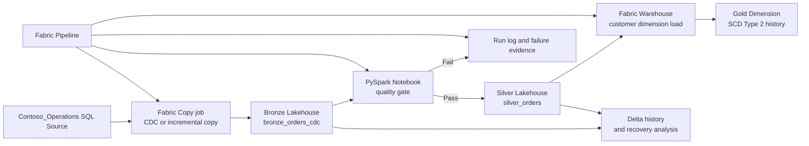

# Getting Started

### Estimated Duration: 25 Minutes

## Scenario

You are a data engineer on the Contoso modernization team and have been asked to complete the Microsoft Fabric implementation for an enterprise medallion architecture. The Azure-side sandbox, identity, and source-system prerequisites are already available, but the Fabric data estate is intentionally incomplete. During this challenge lab, you will create the required Fabric items, implement CDC-driven Bronze ingestion, preserve historical customer state in Gold, enforce Silver quality gates with PySpark, recover from a controlled Delta incident, and orchestrate the full process with observable run evidence.

## Lab Overview

This lab is organized as a six-challenge implementation journey in Microsoft Fabric. Unlike an outcome-only challenge sheet, the guide now gives you a practical action sequence for each challenge while still requiring you to validate the technical result yourself. You will work across Fabric workspace items such as a Lakehouse, Warehouse, notebook, Copy job, and pipeline, and you will confirm the resulting data states by using SQL results, Delta history, notebook output, and pipeline monitoring.

Because Microsoft Fabric items are control-plane objects, you must treat the workspace, Lakehouse, Warehouse, notebook, Copy job, and pipeline used in this lab as learner-created unless a later challenge explicitly tells you to reopen something you created earlier. Do not assume those items already exist in the sandbox.

## Objectives

By the end of this lab, you will be able to:

- Sign in to Azure and Microsoft Fabric by using the lab credentials.
- Confirm the Contoso medallion target state and create the core Fabric items needed for the lab.
- Implement CDC-based ingestion from the source system into the Bronze Lakehouse layer.
- Build Gold-layer customer history tracking by using an SCD Type 2 pattern in a Fabric Warehouse.
- Use a PySpark notebook to block promotion to Silver when data quality checks fail.
- Use Delta history and restore capabilities to investigate and recover a corrupted table state.
- Coordinate ingestion, validation, and dimensional loading through a Fabric Pipeline and verify both success and failure run paths.

## Sign in to the lab environment

1. Open <https://portal.azure.com>.
2. Sign in with the following credentials:
   - Username: <inject key="AzureAdUserEmail"></inject>
   - Password: <inject key="AzureAdUserPassword"></inject>
3. Verify that the active subscription is **<inject key="SubscriptionID"></inject>**.
4. Verify that the Microsoft Entra tenant is **<inject key="TenantID"></inject>**.
5. Record the deployment reference as **<inject key="DeploymentID" enableCopy="false"></inject>** for this sandbox session.
6. Open the Microsoft Fabric portal at <https://app.fabric.microsoft.com> by using the same credentials.
7. Confirm that you can access a Fabric-capable workspace experience and that you can create new items.

> [!Important]
> Microsoft Fabric workspaces, Lakehouses, Warehouses, notebooks, Copy jobs, and pipelines are not Azure ARM resources. In this lab, those items are created and configured inside the Fabric portal as part of the learner workflow.

## Before you begin

Before starting Challenge 1, verify the following conditions:

- You can access both the Azure portal and the Microsoft Fabric portal.
- Your account has permission to create or modify items in the Fabric workspace used for the lab.
- The Contoso_Operations source connectivity and source data required by the challenges are already available in the sandbox.
- PySpark notebook execution is available in Fabric.
- You are prepared to validate results by inspecting row counts, Delta table history, Warehouse query output, notebook runs, and pipeline activity status.

> [!Note]
> The sandbox prepares Azure-side dependencies and source prerequisites, but the Fabric implementation work remains part of the lab. Create the Fabric items carefully and keep your naming consistent so later challenges can reuse what you build.

## Challenge sequence

You will complete the lab in the following order:

- **Challenge 1:** Confirm the medallion foundation and target state.
- **Challenge 2:** Implement CDC ingestion into the Bronze layer.
- **Challenge 3:** Implement SCD Type 2 history in the Gold Warehouse.
- **Challenge 4:** Enforce Spark-based data quality gates before Silver promotion.
- **Challenge 5:** Audit, recover, and protect data with Delta Lake time travel.
- **Challenge 6:** Orchestrate the end-to-end medallion pipeline with internal run-state validation.

## Recommended working approach

Use the following approach throughout the lab:

1. Create the core Fabric items in Challenge 1 and record their names.
2. Reuse those same items in later challenges instead of creating duplicate assets.
3. After each challenge, verify the actual technical outcome before you continue.
4. If a run fails, use built-in Fabric evidence such as notebook output, Copy job history, Warehouse queries, and pipeline monitoring to determine why.
5. Keep the medallion intent clear:
   - Bronze captures raw operational changes.
   - Silver receives only validated data.
   - Gold exposes business-ready historical structures.

## Architecture

The Contoso solution uses a medallion design in Microsoft Fabric. Operational changes are ingested into Bronze, quality checks determine whether curated data can move to Silver, customer history is preserved in Gold, and a pipeline coordinates the end-to-end process.

## Solution components

### Source system

The source system is the Contoso_Operations SQL workload. It contains operational tables such as Orders, Customers, and Products, and it provides the change activity used for the ingestion and historical tracking tasks in this lab.

### Workspace

A Fabric workspace is the logical container where you create and manage items such as Lakehouses, Warehouses, notebooks, and pipelines. Microsoft Learn documents the workspace as the place that holds the items required for lakehouse and warehousing solutions, and this lab follows that same pattern.

### Bronze layer

The Bronze layer lands raw source changes into Delta tables in a Fabric Lakehouse. In this lab, the key Bronze object is `bronze_orders_cdc`, which you will use to prove both the first load and a later incremental change capture.

### Silver layer

The Silver layer contains cleaned and validated data. In this lab, `silver_orders` should only be written when the PySpark quality gate passes the required checks.

### Gold layer

The Gold layer is implemented with a Fabric Warehouse that supports SQL-based dimensional modeling. You will build customer history tracking with an SCD Type 2 pattern that preserves current and expired versions of changed rows.

### Copy and transformation services

Microsoft Learn describes Fabric Data Factory Copy job as supporting full and incremental copy, including CDC-based incremental replication when the source supports CDC. You will use that pattern to move source changes into Bronze, then use a PySpark notebook to evaluate data quality before promotion.

### Recovery and observability

Fabric Lakehouse tables use Delta Lake format, which enables version history and recovery-oriented workflows. Later in the lab, you will use these capabilities to inspect a corrupted state and restore a known good version. You will also use Fabric Pipeline run history and activity results as the evidence model for orchestration success and failure.

## What you will create during the lab

Across the six challenges, you are expected to create or complete the following types of Fabric assets:

- One Fabric workspace for the Contoso scenario, if a dedicated workspace is not already open for you.
- A Lakehouse for Bronze and Silver layer tables.
- A Warehouse for Gold-layer dimensional objects.
- A Copy job for Bronze ingestion.
- A PySpark notebook for Silver quality checks and controlled promotion behavior.
- A Fabric Pipeline that coordinates the end-to-end execution path.

> [!Tip]
> Choose clear, reusable names for your workspace items in Challenge 1 and keep a short record of those names. Later challenges assume you can quickly reopen the same Lakehouse, Warehouse, notebook, and pipeline.

## Evidence you should capture as you work

As you progress through the lab, be ready to confirm the following evidence points:

- The required workspace items exist and match the medallion design.
- `bronze_orders_cdc` shows an initial load and a later incremental change result.
- The customer dimension in the Warehouse contains both current and expired rows after change processing.
- The quality notebook blocks Silver writes when data defects are present.
- Delta history and recovery actions return the Silver dataset to a known good state.
- The pipeline shows a successful run for the clean-data path and a blocked or failed downstream path for the defect scenario.

## How the guide is organized

The remaining pages are written as Challenge 1 through Challenge 6. Each challenge includes a concrete implementation sequence so you can build the required Fabric solution step by step while still proving the technical result independently.

When a later challenge says to open an item, use the exact item that you created earlier in this same lab run rather than creating a replacement unless the instructions explicitly require a new object.

## After publishing

> [!Note] These steps run **after** you push the template to CloudLabs — they verify CloudLabs can actually serve this lab guide to candidates.

- **Verify docs-proxy access:** open Templates → your template → **Lab Guide Settings** in <https://admin.cloudlabs.ai> and confirm CloudLabs can reach this repo via the docs proxy. If the repo is private, configure GitHub access at the template level.
- **Verify inline questions and inline validations:** sign in to <https://admin.cloudlabs.ai>, open your template, and walk through one full lab run to confirm every `<question>` and `<validation step="..."/>` renders correctly. Fix any that don't resolve.
